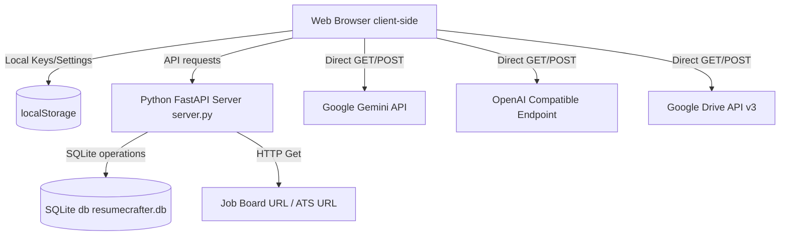

# ResumeCrafter — Personal Resume & Job Application Workspace

**ResumeCrafter** is a premium, privacy-centric workspace for building, tailoring, and managing professional resumes. 

The application is built with a vanilla frontend (HTML, CSS, JavaScript) served by a lightweight Python backend running a **FastAPI** REST API. Application data (resumes, job records, tailored snapshots, cover letters) is stored in a local, persistent **SQLite** database, and can optionally be exported and saved directly as Google Docs on Google Drive. Sensitive API keys and credentials reside exclusively in the client's browser **`localStorage`**, ensuring they never leave your device.

---

## Key Features

*   **Base Resume & Auto-Save**: Real-time auto-saving as you type, storing personal details, experience lists, education histories, and key projects directly in your browser.
*   **Job Tracker & Scraper**: Built-in scraper that runs through a lightweight local Python proxy to fetch, clean, and extract text and keywords from online job postings. Features an independently collapsible Job Description area to optimize workspace layout.
*   **AI Cover Letter Generator**: Generate professional, targeted cover letters on-demand using the active LLM provider (Gemini or OpenAI Compatible backend) based on your resume profile and the job description, with customizable target word count constraints and a quick copy-to-clipboard tool.
*   **Snapshot-Based Tailoring**: One-click cloning to fork your Base Resume into tailored, job-specific resume variants. Edit a tailored resume safely without altering your base file.
*   **Rich Typography Customization**: Select fonts (Outfit, Inter, Roboto), line-heights, custom margin spacing, template colors, and reorder document sections dynamically.
*   **Inline Markdown Toolbars**: Select any segment of text in experience, education, or project descriptions to quickly format using **Bold**, *Italic*, or `• Bullet lists` with immediate layout updates.
*   **Inline ✨ AI Rewrite Modals**: Compare original and modified versions side-by-side. Instruct the LLM (e.g. *“Make this bullet point sound more result-oriented”*) to tailor summaries or bullet items to target job descriptions.
*   **Hybrid Keyword Matcher**:
    *   *Regex Match*: Private local regex extraction scanning against an embedded vocabulary list.
    *   *AI Match*: Semantic ATS scanning, compatibility scores, and 3 specific tailoring bullet recommendations powered client-side by Google Gemini or OpenAI Compatible Endpoints (like LiteLLM, etc).
*   **Google Drive Multipart Backups**: Google Identity Services integration with sandboxed `drive.file` scope. Automatically creates a `resumecrafter/` backup folder on Google Drive and uploads files as clean Markdown documents.
*   **Print-Perfect PDF Outputs**: Custom `@media print` rules specifically styled for letter/A4 outputs, ensuring layout elements split pages neatly without orphan headings or split paragraphs.

---

## Architectural Breakdown



---

## Quick Start (Running Locally)

1.  Clone the repository:
    ```bash
    git clone https://github.com/your-username/resume-crafter.git
    cd resume-crafter
    ```
2.  Install dependencies:
    ```bash
    pip install fastapi uvicorn
    ```
3.  Start the Python FastAPI local backend server:
    ```bash
    python3 server.py
    ```
4.  Open your browser and navigate to:
    [http://localhost:8000](http://localhost:8000)

---

## API & Credentials Configurations

To respect user privacy, ResumeCrafter stores sensitive configurations and API credentials (like Gemini keys and Google Drive Client IDs) exclusively in your browser's **`localStorage`**. They are never saved to the backend database or transmitted anywhere other than direct, encrypted requests to the respective service providers (Google, OpenAI, etc.).

### 1. Google Gemini API (For AI Matches & Inline Rewrites)
1.  Go to the **Integrations** tab.
2.  Paste your Google Gemini API key.
3.  Click **Test Connection** to confirm connectivity.
4.  Toggle the keyword analyzer tab in the drawer from *Regex Match* to *AI Match*.

### 2. Other/Local AI Models (Ollama, vLLM, etc)
You can direct AI requests to locally hosted LLMs or OpenAI compatible proxies:
1.  Go to the **Integrations** tab and set the provider to **<Your Local LLM Provider, e.g. Ollama, LMStudio, etc >**.
2.  Enter the base URL (e.g., `http://localhost:11434/v1` for Ollama, or whatever port your LLM is hosted on).
3.  Specify the target model name (e.g., `gemma4` or `gpt-3.5-turbo`).
4.  Provide the Bearer token if utilizing an authenticated endpoint.
5. Test AI Connection

### 3. Google Drive Sync Setup (Optional)
ResumeCrafter includes a default Google OAuth Client ID pre-configured for `http://localhost:8000` environments. 

If hosting ResumeCrafter on your own domain or staging server:
1.  Create a project in the [Google Cloud Console](https://console.cloud.google.com/).
2.  Enable the **Google Drive API**.
3.  Configure your **OAuth Consent Screen** (specify the `https://www.googleapis.com/auth/drive.file` scope).
4.  Create a **Web Client ID**, adding your domain address to the *Authorized JavaScript Origins* list.
5.  Go to the **Integrations** tab in the app and input your new Client ID to overwrite the default fallback.

---

## License

This project is licensed under the MIT License. See the `LICENSE` file for details.
